# Laravel JobPortal Reverse Engineering

This document traces implemented business logic from `routes`, `middleware`, `controllers`, `models`, and `migrations`.

## Runtime Middleware Chain

Global web middleware appended in `bootstrap/app.php`:
- `SetLocale`
- `CheckUserStatus`
- `CheckMenuPermission`

Route middleware used by lifecycle routes:
- `auth` (applicant protected routes and all `/admin/*`)
- `guest`, `signed`, `throttle:6,1` (supporting auth routes in `routes/auth.php`)

Actual behavior:
- `CheckUserStatus`: if authenticated and `statusaktif == 0`, force logout + invalidate session.
- `CheckMenuPermission`: only enforces `admin/*`; checks menu URLs from `roles -> aksesmenus -> menus`; bypasses role id `1`; several `admin/*` prefixes are excluded.
- `SetLocale`: session locale fallback to `id`.

## Role Relationship and Authorization Structure

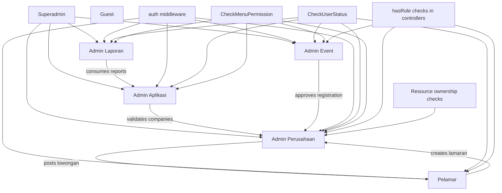

Seeded roles from `database/seeders/RolePermissionSeeder.php`:
- `Superadmin`
- `Admin Aplikasi`
- `Admin Perusahaan`
- `Pelamar`
- `Admin Laporan`

Runtime role checks also reference:
- `Admin Event` (used in multiple controllers, not created by default seeder)
- fallback role name `Perusahaan` during company registration error path

## Role-by-Role Access Mapping

## `Pelamar`

Route group:
- `Route::middleware('auth')->group(...)` in `routes/web.php`

Primary routes/actions:
- `GET /pelamar/dashboard` -> `Pelamar\DashboardController@index`
- `POST /apply-job` -> `Pelamar\ApplyController@apply`
- `POST /wishlist/toggle` -> `Pelamar\WishlistController@toggle`
- `GET /pelamar/absen/{id}` -> `Admin\AbsensiController@scanAbsen`
- `GET /pelamar/kartu/{ideven}` -> `Pelamar\DashboardController@printCard`
- `GET /complete-profile`, `POST /complete-profile` -> `PelamarRegisterController`

Authorization checks:
- `DashboardController@index`: explicit `hasRole('Pelamar')`.
- Profile completeness gate across multiple controllers: `user.idpelamar` must exist.
- Attendance scan requires role `Pelamar` and existing `Lamaran` for scanned lowongan.

Ownership restrictions:
- Applicant can only scan attendance for lowongan where applicant has a lamaran (`idpelamar + idlowongan`).

Hidden dependencies:
- Successful `apply` creates `system_notifications` for company user.
- Dashboard recommendations depend on `register.aktivasi = 1` and active event.

## `Admin Perusahaan`

Route group:
- `Route::middleware('auth')->prefix('admin')->group(...)`

Primary modules/routes:
- Company dashboard/event registration/payment/invoice (`PerusahaanDashboardController`)
- Company profile and documents (`PerusahaanProfileController`)
- Vacancy management (`PerusahaanLokerController`)
- Applicant review (`PerusahaanPelamarController`)
- Attendance (`AbsensiController` and vacancy attendance actions)

Authorization checks:
- `PerusahaanDashboardController@index`: role-gates non-company users.
- Strong ownership checks in many methods: `resource.idperusahaan == auth()->user()->idperusahaan`.

Ownership restrictions implemented:
- Invoice and event detail checks in `downloadInvoice`/`myEventDetail`.
- Vacancy CRUD, toggle, attendance, applicants scoped to company via register/lowongan relation.
- Document delete enforces same company owner.

Ownership gaps:
- `storePayment` validates `idregister` exists but does not enforce register ownership.
- `PerusahaanPelamarController@show/downloadCV/sendMail` path lacks strict verification that selected pelamar belongs to a lamaran in current company scope.

## `Admin Event`

Route group:
- same `/admin/*` auth group

Implemented scoping:
- In `EventRegistrationController`, `RegistrasiLowonganController`, `PelamarEventController`, `LowonganKerjaController`, `LaporanController`: if role is `Admin Event`, data is filtered by `user.ideven`.

Gaps:
- Some actions (`approve`, `showDetail`, toggles/deletes) do not consistently enforce event ownership beyond UI/list filtering.

## `Admin Aplikasi` and `Superadmin`

Primary modules:
- `AdminController`: company validation/rejection and admin dashboard queues
- User/role/menu/access management (`UserController`, `RoleController`, `MenuController`, `AksesMenuController`)
- Event management (`EvenController`)

Authorization:
- Superadmin bypass in `CheckMenuPermission` via role id `1`.
- Route-level protection mostly `auth`; no policy/gate layer observed.

## `Admin Laporan`

Primary module:
- `/admin/laporan/*` via `LaporanController`

Authorization:
- depends on auth + menu access + controller behavior; no dedicated policy object.

## `Guest`

Primary access:
- public pages: home/events/vacancy detail, registration flows, activation links
- public status endpoint: `/v/p/{encrypted_id}/{ideven}`

## Module Dependency Graph

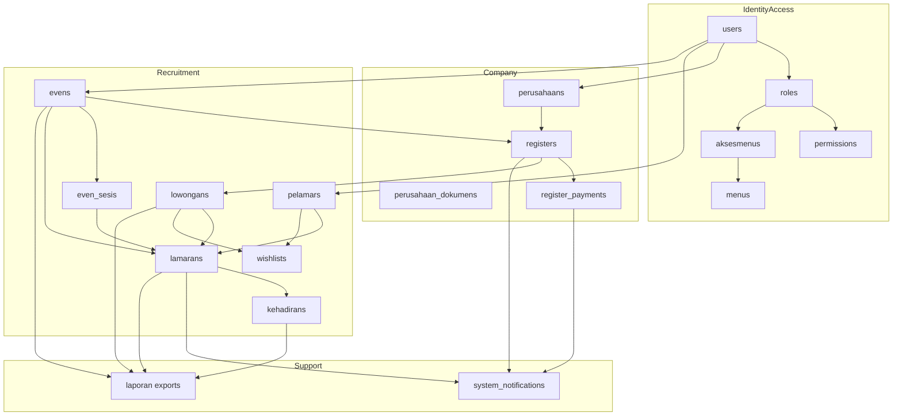

## ER Relationship Diagram (Schema-Centric)

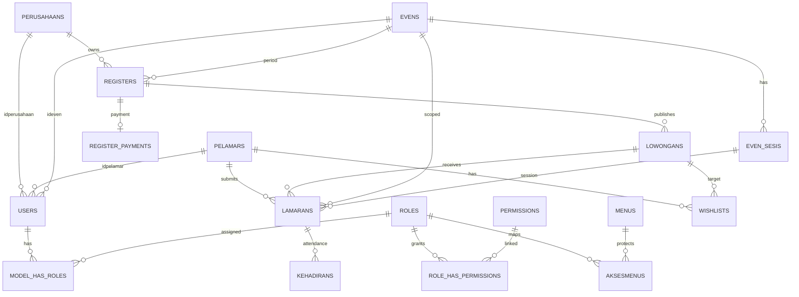

## Applicant Lifecycle (Route -> Middleware -> Controller -> Model)

## A. Registration and activation

Routes:
- `GET /register-pelamar` -> `showRegistrationForm`
- `POST /register-pelamar` -> `register`
- `GET /activate-pelamar/{token}` -> `activate`

Execution:
1. Request enters web middleware (`SetLocale`, `CheckUserStatus`, `CheckMenuPermission` no-op for non-admin path).
2. `PelamarRegisterController@register` validates:
   - `name required|string|max:255`
   - `email required|email|unique:users,email`
   - `password required|min:8|confirmed`
3. Creates `users` row with activation fields:
   - `activation_token` random
   - `is_active = false`
   - `statusaktif = 0`
4. Assigns role `Pelamar`.
5. Sends `UserActivationMail`.
6. `activate` token endpoint flips:
   - `activation_token -> null`
   - `is_active -> true`
   - `statusaktif -> 1`
   - `activated_at -> now()`

Status transition diagram:

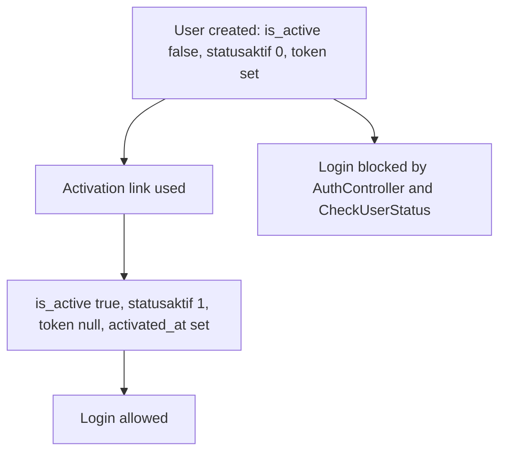

## B. Profile completion lifecycle

Routes:
- `GET /complete-profile` -> `showCompleteDataForm` (`auth`)
- `POST /complete-profile` -> `storeCompleteData` (`auth`)

Execution:
1. `auth` middleware + global middleware.
2. `storeCompleteData` validates applicant profile, education, skills, and docs.
3. Writes:
   - `Pelamar::updateOrCreate`
   - multiple `Pelamarpendidikan`, `Pelamarskill`, `Pelamarpengalaman`
   - multiple `Pelamardokumen`
   - updates `users.idpelamar`
4. Existing profile update path deletes old education/skills/experience before re-insert.

Critical rule:
- If `users.idpelamar` absent, many features redirect/block (`dashboard`, `apply`, `wishlist`, even some frontend pages).

## C. Apply workflow

Route:
- `POST /apply-job` -> `Pelamar\ApplyController@apply` (`auth`)

Sequence:

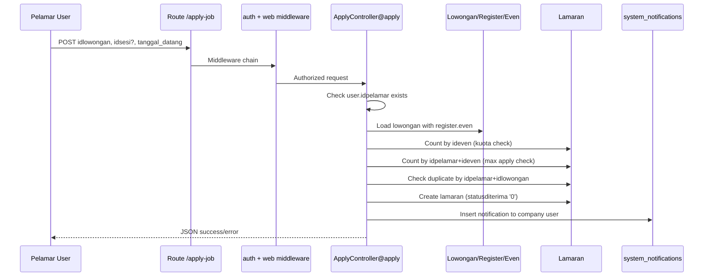

Validation and business rules:
- `idlowongan required`
- `idsesi nullable`
- `tanggal_datang required|date`
- Event global quota: `lamarans per ideven <= evens.kuota_maksimum`
- Per applicant max apply: `lamarans by idpelamar per ideven <= evens.maksimum_apply`
- Duplicate lowongan apply blocked
- `statusditerima` initialized to `'0'`

Edge handling:
- profile missing => HTTP 403 JSON
- quota/max/duplicate => HTTP 422 JSON
- exception => HTTP 500 JSON

## D. Attendance scan lifecycle

Route:
- `GET /pelamar/absen/{id}` -> `Admin\AbsensiController@scanAbsen` (`auth`)

Execution checks:
1. decrypt lowongan id.
2. require authenticated `Pelamar`.
3. require linked `pelamar`.
4. require existing `lamaran` for this pelamar and lowongan.
5. enforce event date window (`tanggalawal`..`tanggalselesai`).
6. if sessionized event (`status_sesi == 1`) and lamaran has sesi:
   - enforce current time in `jam_mulai`..`jam_selesai`.
7. upsert `Kehadiran` by `idlamaran` with `statushadir = 1`.

Attendance lifecycle diagram:

```mermaid
flowchart TD
  A0[Scan QR /pelamar/absen/{encrypted}] --> A1[Decrypt lowongan id]
  A1 -->|fail| Aerr1[Redirect error: QR invalid]
  A1 --> A2[Role check: Pelamar]
  A2 -->|fail| Aerr2[Redirect login]
  A2 --> A3[Has pelamar profile]
  A3 -->|fail| Aerr3[Redirect dashboard]
  A3 --> A4[Lamaran exists for vacancy]
  A4 -->|fail| Aerr4[Redirect dashboard]
  A4 --> A5[Event date window valid]
  A5 -->|fail| Aerr5[Event not started/ended]
  A5 --> A6[If sesi enabled, check session time]
  A6 -->|fail| Aerr6[Outside session time]
  A6 --> A7[Kehadiran updateOrCreate]
  A7 --> Aok[Attendance success]
```

## Company Lifecycle (Route -> Middleware -> Controller -> Model)

## A. Company registration and activation

Routes:
- `GET /register-perusahaan`
- `POST /register-perusahaan`
- `GET /perusahaan/activate/{token}`

Execution:
1. `PerusahaanRegisterController@register` validates company identity + account fields.
2. Creates `perusahaans` with `is_verified = false`.
3. Creates `users` with:
   - `idperusahaan`
   - `activation_token`
   - `is_active = false`
   - `statusaktif = 0`
   - `statusvalidasi = 0`
4. Assigns `Admin Perusahaan` (fallback `Perusahaan` role on assignment failure).
5. Sends activation mail.
6. Activation endpoint flips user active fields and inserts system notification.

Validation highlights:
- company email unique in both `perusahaans.email` and `users.email`
- password confirmed min 8
- `idkategori` and `idkelurahan` must exist

## B. Admin validation lifecycle

Routes:
- `GET /admin/company-validation/{id}`
- `POST /admin/company-validation/{id}/approve`
- `POST /admin/company-validation/{id}/reject`

Execution:
- `validateCompany`:
  - decrypts id
  - blocks if `statusaktif == 0` (not email activated)
  - sets `users.statusvalidasi = 1`
  - sends approval email
- `rejectCompany`:
  - validates rejection reason
  - sends rejection email
  - does not persist a rejection status field in this method

Company status transitions:

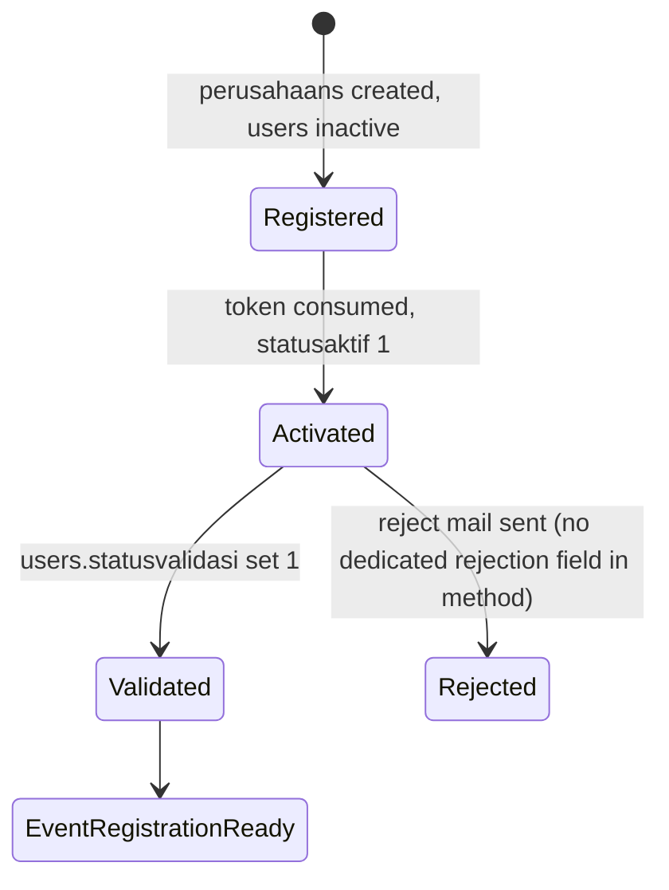

## C. Company profile and document lifecycle

Routes:
- `GET /admin/perusahaan/profile`
- `POST /admin/perusahaan/profile`
- `DELETE /admin/perusahaan/profile/document/{id}`

Execution:
- profile update validates company data + optional logo/documents.
- documents inserted into `perusahaan_dokumens` with `status = 0`.
- delete document enforces `doc.idperusahaan == current company`.

## Event Registration Lifecycle

Routes:
- `GET /admin/perusahaan/event/{id}/detail`
- `POST /admin/perusahaan/event/{id}/register`
- `POST /admin/perusahaan/payment/confirm`
- `GET /admin/pendaftar-event`
- `POST /admin/pendaftar-event/{id}/toggle-aktivasi`
- `GET /admin/event-registration/{id}`
- `POST /admin/event-registration/{id}/approve`

Execution trace:
1. Company opens event detail.
2. `registerEvent` validates terms (and package when event has package mode).
3. Prevents duplicate register by `(idperusahaan, idperiode)`.
4. Creates `registers`:
   - `aktivasi = 0`
   - package/biaya fields
5. Writes registration notification.
6. Company uploads payment proof -> creates `register_payments` with status `'Menunggu Verifikasi'`.
7. Admin/Event admin approves registration -> `registers.aktivasi = 1`.
8. `toggleAktivasi` can flip activation.

Event registration status transitions:

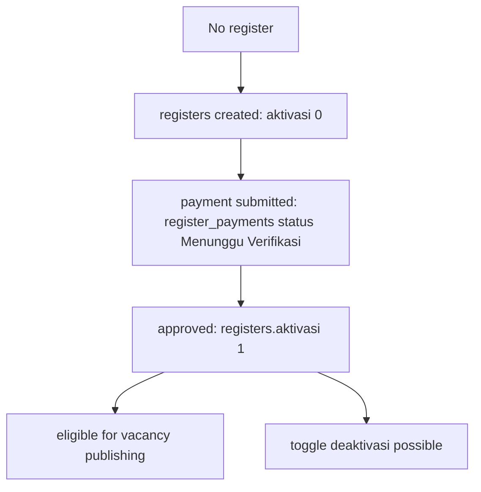

Critical implementation notes:
- Mixed encrypted/plain IDs across actions.
- Duplicate route declarations exist for `/admin/event-registration/{id}` and `/approve` with different controllers.
- `AdminController` lacks methods `showEventRegistrationDetail` and `approveEventRegistration` while routes reference them.

## Vacancy Lifecycle

Routes:
- `/admin/perusahaan/event/{id}/create-loker` (GET/POST)
- `/admin/perusahaan/event/{id}/import-loker` (POST)
- `/admin/perusahaan/loker/{id}/edit` (GET), `/update` (POST)
- `/admin/perusahaan/loker/{id}/toggle-status` (POST)
- `/admin/perusahaan/dataloker` (GET)
- `/admin/lowongan-kerja` and `/admin/lowongan-kerja/{id}` (audit)

Execution:
- `create`/`store` require:
  - register belongs to current company
  - `register.aktivasi == 1`
- `store` validates core vacancy fields and sanitizes salary fields.
- New/imported vacancy uses `status = 1`.
- `toggleStatus` enforces ownership and registration activation before switching `1 <-> 0`.

Vacancy status lifecycle:

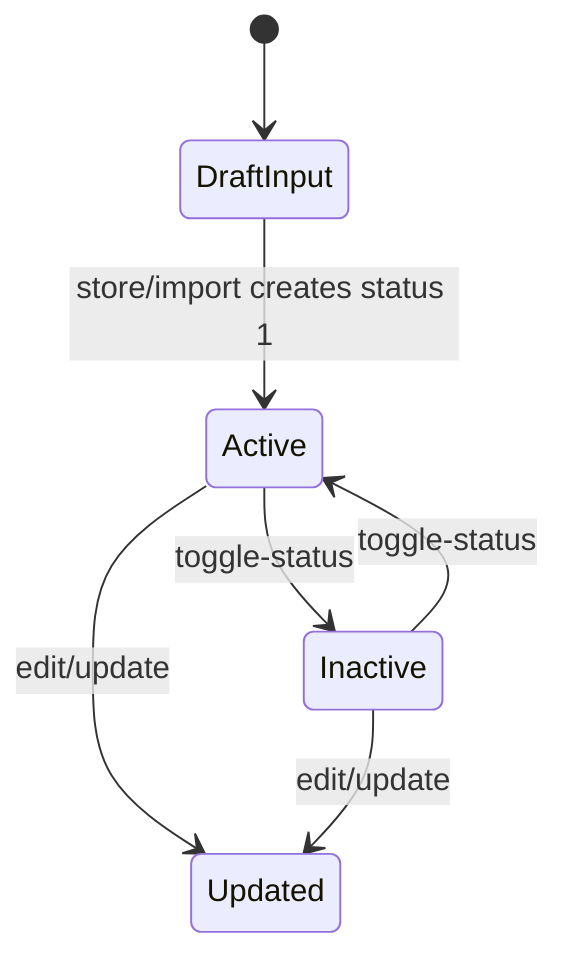

## Application Lifecycle

Routes:
- `POST /apply-job`
- admin review routes in company and event modules:
  - `/admin/perusahaan/pelamar*`
  - `/admin/registrasi-lowongan`
  - `/admin/pelamar/even`

Execution:
- create lamaran with `statusditerima = '0'`, `tanggalmelamar = now`, optional `idsesi`.
- review endpoints are read-oriented lists/details/export/mail.

Application status transition evidence:

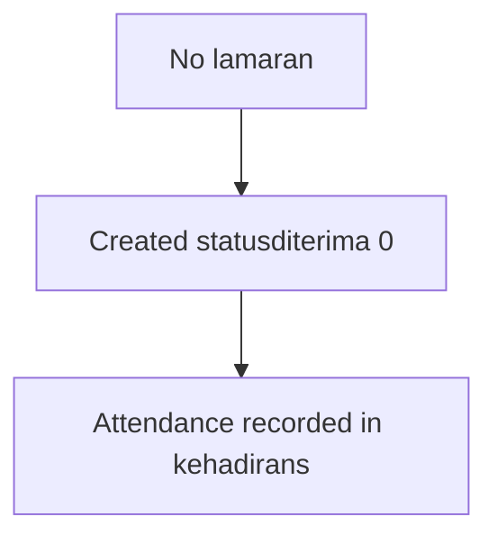

Note:
- In scoped controllers analyzed, explicit transitions of `statusditerima` beyond initial create are not implemented.

## Attendance Lifecycle (Admin and Applicant)

Routes:
- Applicant QR: `/pelamar/absen/{id}`
- Admin/company manual attendance:
  - `/admin/absensi/{id}/manual`
  - `/admin/perusahaan/absensi/{id}/manual`
  - vacancy attendance update endpoint

Execution:
- manual attendance receives `presents[]` lamaran ids.
- for each lamaran in lowongan:
  - present -> upsert kehadiran (`statushadir = 1`)
  - absent from selection -> delete kehadiran row

Attendance data dependency:
- Attendance is keyed by `idlamaran`, not by date/session composite.

## Reporting Lifecycle

Routes:
- `/admin/laporan/pelamar-loker`
- `/admin/laporan/loker-event`
- `/admin/laporan/kehadiran`
- `/admin/laporan/pelamar-detail`

Execution:
- query builders over `lowongans`, `lamarans`, `kehadirans`, `evens`, `perusahaans`, `pelamars`.
- role-based event scoping for `Admin Event`.
- output branches include HTML and export variants (PDF/Excel).

## RBAC Authorization Flow (Detailed)

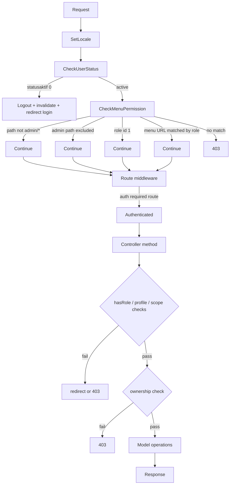

## Hidden Dependencies and Cross-Module Coupling

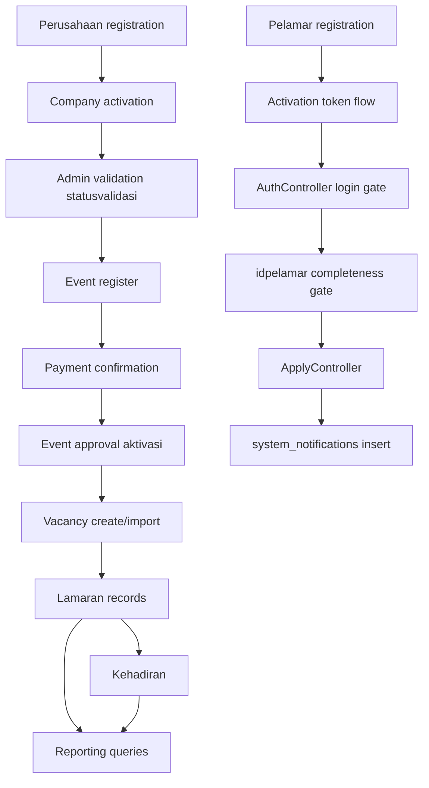

## Critical Business Rules (Implemented in Code)

1. User login is blocked for inactive account (`statusaktif == 0` or `is_active == false`).
2. Applicant actions require linked `idpelamar`.
3. Apply requires vacancy, event quota availability, max apply availability, and no duplicate lamaran.
4. Attendance scan requires role `Pelamar`, existing lamaran for vacancy, valid event date window, and session time window when enabled.
5. Company vacancy operations require registration ownership and `register.aktivasi == 1`.
6. Company invoice/event detail endpoints enforce company ownership.
7. Admin event-scoped users are constrained by `user.ideven` in list/report modules.
8. Menu access middleware controls admin path access via `menus` and `aksesmenus` mapping.

## Edge Cases and Implementation Risks

1. Duplicate route definitions for `/admin/event-registration/{id}` and `/approve` target different controllers.
2. Referenced methods missing in `AdminController` for one duplicate route pair.
3. `storePayment` lacks register ownership enforcement.
4. `PerusahaanPelamarController` detail/CV/mail paths can bypass strict company-lamaran ownership linkage.
5. Session apply path may write `idsesi = 0` when event uses sessions; FK compatibility depends on DB constraints/behavior.
6. Document status type inconsistency (`perusahaan_dokumens.status` migration default string-like state vs controller writing numeric `0`).
7. Attendance manual flow deletes unchecked kehadiran rows, making attendance state destructive per submit cycle.

## Workflow Sequence: End-to-End Recruitment

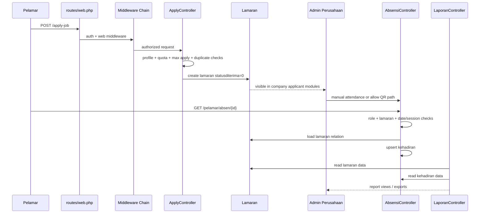

